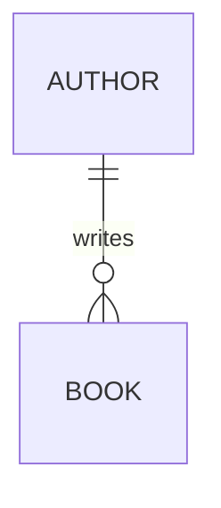

```mermaid
erDiagram
  AUTHOR || --o{ BOOK : writes
```

```mermaid
erDiagram
  AUTHOR {
      int author_id
      string name
  }
  BOOK {
    in book_id
    string title
  }
  AUTHOR ||--o{ BOOK : writes
